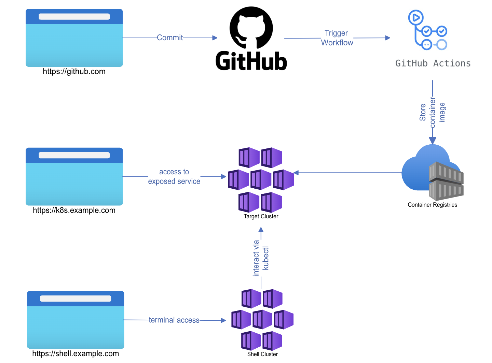
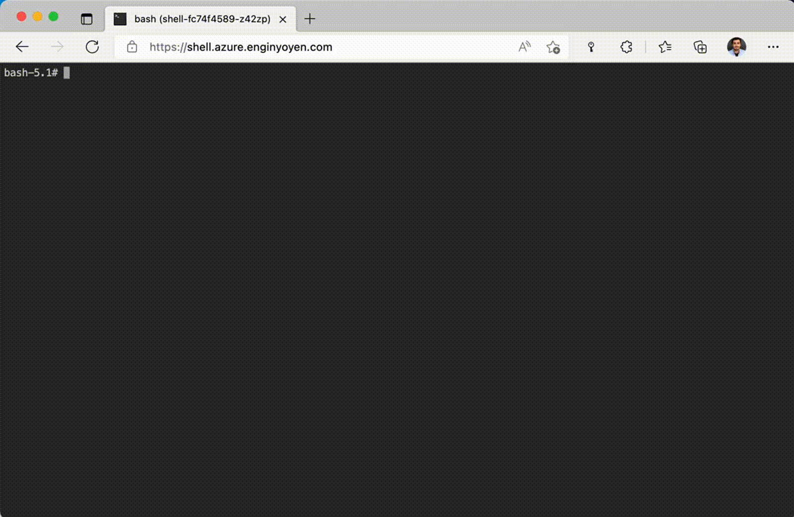

# Intro-to-kubernetes-workshop
This repository contains labs and environment setup for a kubernetes workshop.

## Modality 
The workshop was designed for **the new comers**, it is **hands-on**, and only requires modern browser(e.g. Microsoft Edge/Google Chrome) and GitHub account.

Participant are provided access to a kubernetes cluster via a terminal over browser, the aim is to deliver maximum amount of content at minimum amount of time without spending time on setting up a development environment, so all the tools and sample codes can be provided equally to everyone. See the section below how to setup workshop environment.

The workshop is aimed to:
* explain what containers are
* how one can build an container image
* what is kubernetes and why would we need it
* what are the core kubernetes concepts

## Containers
Labs
* [Building an container image](labs/01-Create-a-docker-image.md)
* [Storing the container image](labs/02-Storing-container.md)

## Kubernetes Core Concepts
Labs
* [Pods: creating and managing pods](labs/03-Pods.md)
* [Deployment](labs/04-Deployment.md)
* [ConfigMaps](labs/05-ConfigMaps.md)
* [Mount ConfigMaps to a Pod](labs/06-MountConfigMaps.md)
* [Using Azure Key Vault with AKS](labs/07-AzureKeyVault.md)

## Workshop environment
Workshop environment consist of two kubernetes clusters and container registry:
* azure container registry: Which participant will store the image they build
* target-cluster: Which participant will interact via kubectl and deploy workload
* shell-cluster: Which a shell container prepared via kubectl to connect target-cluster. Shell container is exposed via nginx-ingress controller. 

Shell over browser:

For more details over the setup see [Environment-Setup](environment-setup/environment-setup.md).

## License
Use of this source code is governed by an MIT license that can be found in the LICENSE file.